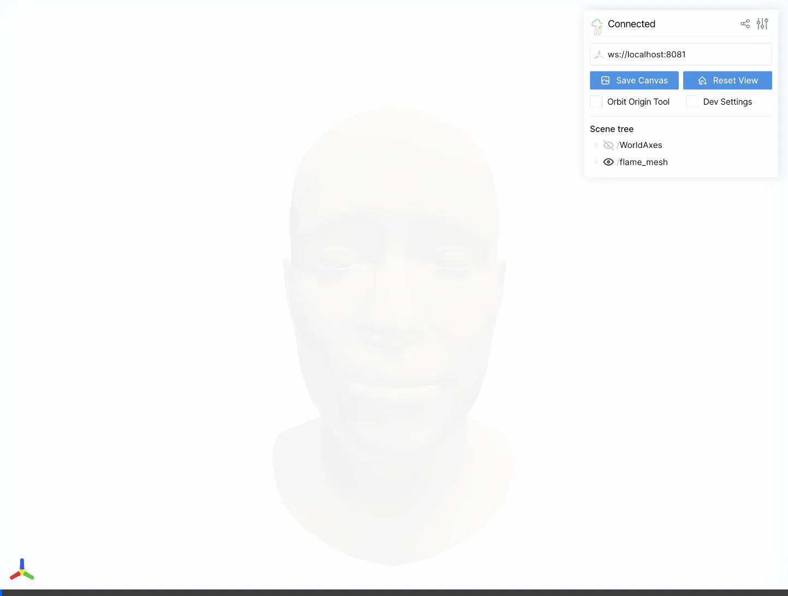

# FLAME MLX: Articulated Expressive 3D Head Model in Apple MLX

This is an implementation of the [FLAME](http://flame.is.tue.mpg.de/) 3D head model using Apple's [MLX](https://github.com/ml-explore/mlx) framework. This port provides a high-performance, differentiable FLAME decoder optimized for Apple Silicon.

## Demo



## Features

- **Pure MLX**: Leverages MLX for efficient tensor operations and automatic differentiation.
- **Complete LBS**: Full implementation of Linear Blend Skinning including shape and pose corrective blendshapes.
- **Landmarks Support**: Support for both static and dynamic (pose-dependent) 3D facial landmarks.
- **Web-based 3D Viewer**: Interactive viewer powered by [Viser](https://github.com/nerfstudio-project/viser) with sliders for:
    - First 10 Identity Shapes
    - First 10 Expressions
    - Neck and Jaw Pose
- **Clean Architecture**: Modularized core logic for easy integration and maintenance.

## Project Structure

```text
├── core/                # Core FLAME MLX package
│   ├── model.py         # FLAME nn.Module implementation
│   ├── ops.py           # Linear Blend Skinning and math operations
│   ├── config.py        # Configuration management
│   └── utils.py         # Utility functions and structures
├── model/               # Place FLAME .pkl files here
├── resources/           # Demo media and assets
├── main.py          # Command line verification script
└── viewer.py        # Interactive web-based 3D viewer
```

## Installation

### 1. Setup Environment
It is recommended to use a virtual environment:

```shell
python3 -m venv .mlx_env
source .mlx_env/bin/activate
```

### 2. Install Dependencies
```shell
pip install -r requirements.txt
```

## Download Models

To run the demos, you need the FLAME model files:

1.  **FLAME Model**: Download `FLAME 2023` from [the official FLAME website](http://flame.is.tue.mpg.de/). You will need to sign up. Place `flame2023_Open.pkl` (or your preferred version) in the `model/` directory.
2.  **Landmark Embeddings**: Download `flame_static_embedding.pkl` and `flame_dynamic_embedding.npy` from the [RingNet Project](https://github.com/soubhiksanyal/RingNet/tree/master/flame_model). Place them in the `model/` directory.

## Usage

### Interactive 3D Viewer
Run the interactive viewer to manipulate the face in real-time:

```shell
python viewer.py
```
Open the provided URL (e.g., `http://localhost:8081`) to access the controls. The viewer starts with a frontal close-up view of the head.

### Command Line Demo
Verify the forward pass and print output tensor shapes:

```shell
python main.py
```

### Integration in Code
```python
import mlx.core as mx
from core import FLAME, get_config

# Load configuration
config = get_config()
config.flame_model_path = './model/flame2023_Open.pkl'

# Initialize model
flame = FLAME(config)

# Prepare parameters (batch size 1)
shape = mx.random.normal((1, 10))   # First 10 shape betas
expr = mx.random.normal((1, 10))    # First 10 expression betas
pose = mx.zeros((1, 6))             # [global_rot(3), jaw_rot(3)]

# Forward pass
vertices, landmarks = flame(shape, expr, pose)
print(f"Vertices shape: {vertices.shape}") # (1, 5023, 3)
```

## License and Citations

The FLAME model is available under the [Creative Commons Attribution 4.0 license](https://flame.is.tue.mpg.de/modellicense.html).

### Referencing FLAME
If you use this code in a scientific publication, please cite the original FLAME paper:

```bibtex
@article{FLAME:SiggraphAsia2017,
  title = {Learning a model of facial shape and expression from {4D} scans},
  author = {Li, Tianye and Bolkart, Timo and Black, Michael. J. and Li, Hao and Romero, Javier},
  journal = {ACM Transactions on Graphics, (Proc. SIGGRAPH Asia)},
  volume = {36},
  number = {6},
  year = {2017},
  url = {https://doi.org/10.1145/3130800.3130813}
}
```

### Referencing RingNet (for Landmarks)
If you use the landmark embeddings, please cite RingNet:

```bibtex
@inproceedings{RingNet:CVPR:2019,
  title = {Learning to Regress 3D Face Shape and Expression from an Image without 3D Supervision},
  author = {Sanyal, Soubhik and Bolkart, Timo and Feng, Haiwen and Black, Michael},
  booktitle = {Proceedings IEEE Conf. on Computer Vision and Pattern Recognition (CVPR)},
  year = {2019}
}
```

## Acknowledgements
This project is an MLX port of the [FLAME_PyTorch](https://github.com/soubhiksanyal/FLAME_PyTorch) repository.
